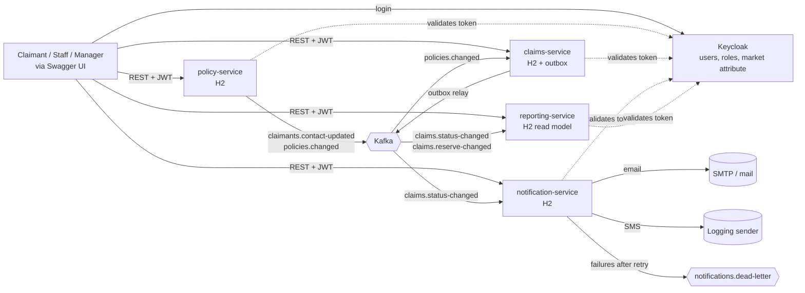

# System Architecture

Services, identity, and messaging. See [PRD.md](../PRD.md) for requirements.

```mermaid
flowchart LR
    U[Claimant / Staff / Manager<br/>via Swagger UI] -->|login| KC[Keycloak<br/>users, roles, market attribute]
    U -->|REST + JWT| POL[policy-service<br/>H2]
    U -->|REST + JWT| CLM[claims-service<br/>H2 + outbox]
    U -->|REST + JWT| NOTIF[notification-service<br/>H2]
    U -->|REST + JWT| RPT[reporting-service<br/>H2 read model]

    POL -. validates token .-> KC
    CLM -. validates token .-> KC
    NOTIF -. validates token .-> KC
    RPT -. validates token .-> KC

    CLM -->|outbox relay| K{{Kafka}}
    POL -->|claimants.contact-updated<br/>policies.changed| K
    K -->|policies.changed| CLM
    K -->|claims.status-changed| NOTIF
    K -->|claims.status-changed<br/>claims.reserve-changed| RPT
    NOTIF -->|email| MAIL[(SMTP / mail)]
    NOTIF -->|SMS| LOG[(Logging sender)]
    NOTIF -->|failures after retry| DLT{{notifications.dead-letter}}
```
