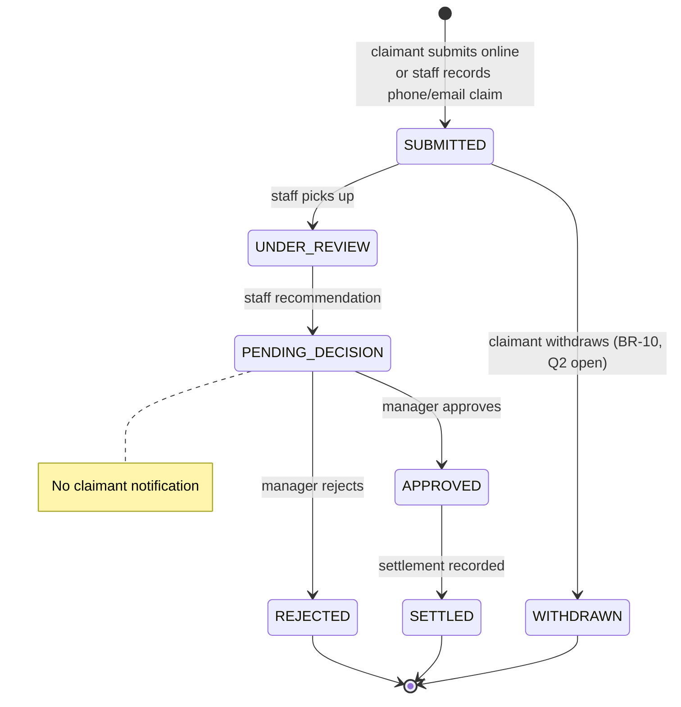

# Claim Lifecycle

Statuses and allowed transitions. See [PRD.md](../PRD.md) sections 6.1 and 6.2.

```mermaid
stateDiagram-v2
    [*] --> SUBMITTED: claimant submits online<br/>or staff records phone/email claim
    SUBMITTED --> UNDER_REVIEW: staff picks up
    SUBMITTED --> WITHDRAWN: claimant withdraws (BR-10, Q2 open)
    UNDER_REVIEW --> PENDING_DECISION: staff recommendation
    PENDING_DECISION --> APPROVED: manager approves
    PENDING_DECISION --> REJECTED: manager rejects
    APPROVED --> SETTLED: settlement recorded
    REJECTED --> [*]
    SETTLED --> [*]
    WITHDRAWN --> [*]

    note right of PENDING_DECISION: No claimant notification
```
