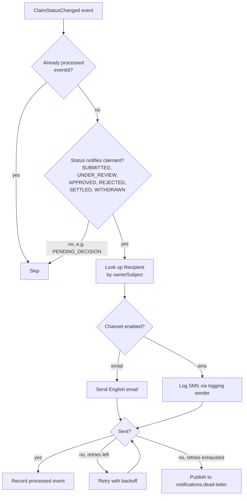

# Notification Flow

How notification-service handles a `ClaimStatusChanged` event. See [PRD.md](../PRD.md) section 10.

```mermaid
flowchart TD
    E[ClaimStatusChanged event] --> D{Already processed<br/>eventId?}
    D -->|yes| SKIP[Skip]
    D -->|no| N{Status notifies claimant?<br/>SUBMITTED, UNDER_REVIEW,<br/>APPROVED, REJECTED,<br/>SETTLED, WITHDRAWN}
    N -->|no, e.g. PENDING_DECISION| SKIP
    N -->|yes| R[Look up Recipient<br/>by ownerSubject]
    R --> CH{Channel enabled?}
    CH -->|email| EM[Send English email]
    CH -->|sms| SM[Log SMS via logging sender]
    EM --> OK{Sent?}
    SM --> OK
    OK -->|yes| REC[Record processed event]
    OK -->|no, retries left| RT[Retry with backoff]
    RT --> OK
    OK -->|no, retries exhausted| DLT[Publish to notifications.dead-letter]
```
