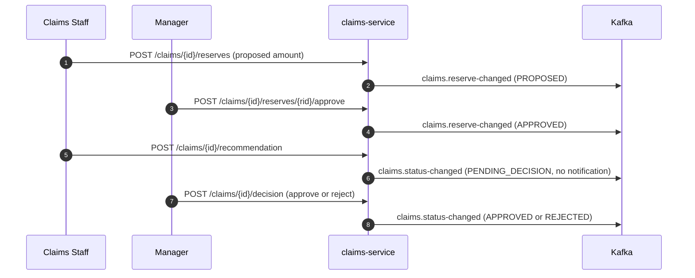

# Reserves and Decisions

Reserve proposal and approval, staff recommendation, and manager decision. See [PRD.md](../PRD.md) sections 4 (BR-6, BR-7) and 7.

```mermaid
sequenceDiagram
    autonumber
    participant S as Claims Staff
    participant M as Manager
    participant CL as claims-service
    participant K as Kafka

    S->>CL: POST /claims/{id}/reserves (proposed amount)
    CL->>K: claims.reserve-changed (PROPOSED)
    M->>CL: POST /claims/{id}/reserves/{rid}/approve
    CL->>K: claims.reserve-changed (APPROVED)
    S->>CL: POST /claims/{id}/recommendation
    CL->>K: claims.status-changed (PENDING_DECISION, no notification)
    M->>CL: POST /claims/{id}/decision (approve or reject)
    CL->>K: claims.status-changed (APPROVED or REJECTED)
```
