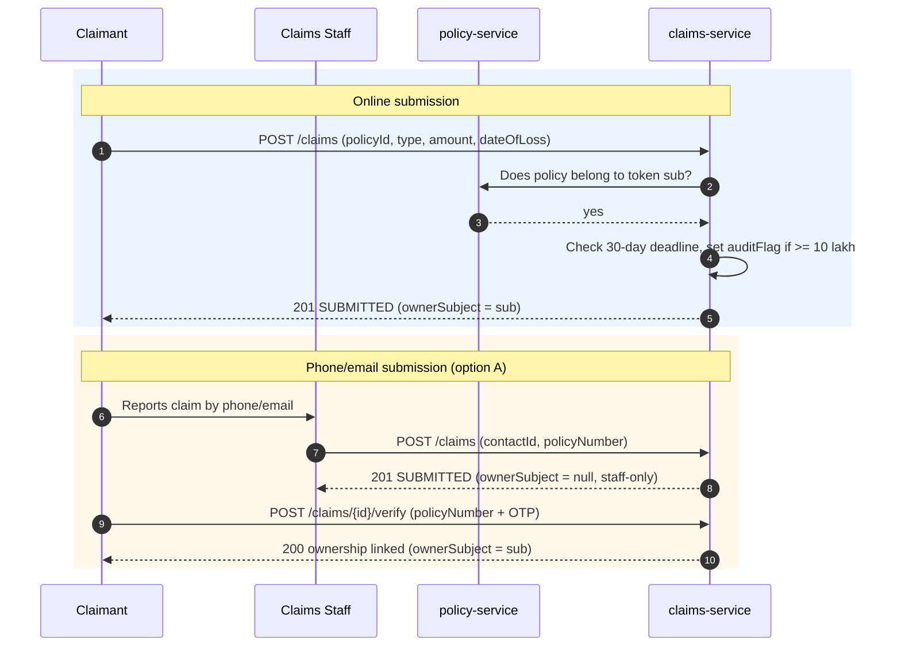

# Claim Submission Flows

Online submission by a claimant, and staff-assisted submission for phone or email reports (option A). See [PRD.md](../PRD.md) section 5.

```mermaid
sequenceDiagram
    autonumber
    participant C as Claimant
    participant S as Claims Staff
    participant P as policy-service
    participant CL as claims-service

    rect rgb(235,245,255)
    Note over C,CL: Online submission
    C->>CL: POST /claims (policyId, type, amount, dateOfLoss)
    CL->>P: Does policy belong to token sub?
    P-->>CL: yes
    CL->>CL: Check 30-day deadline, set auditFlag if >= 10 lakh
    CL-->>C: 201 SUBMITTED (ownerSubject = sub)
    end

    rect rgb(255,248,235)
    Note over C,CL: Phone/email submission (option A)
    C->>S: Reports claim by phone/email
    S->>CL: POST /claims (contactId, policyNumber)
    CL-->>S: 201 SUBMITTED (ownerSubject = null, staff-only)
    C->>CL: POST /claims/{id}/verify (policyNumber + OTP)
    CL-->>C: 200 ownership linked (ownerSubject = sub)
    end
```
